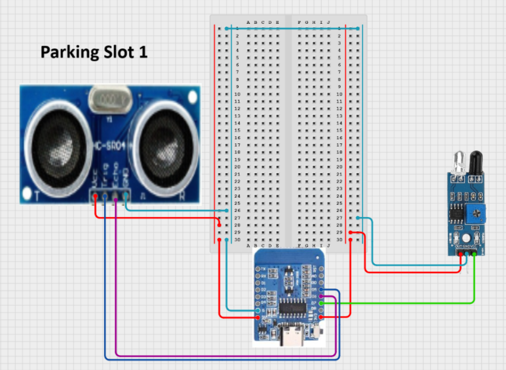

# **ParqSpace**

## **Stack**
Python Flask backend
HTML/CSS/JS frontend
Chart.js for heatmap
RandomForest for prediction
IoT API for distance readings

Readings taken from wemos mini r2 d1 which updates parking status in a web dashboard. Also checks for no parking zone violation and sends alert accordingly. Hardware used other than the wifi module: IR sensor and Ultrasound sensor. RandomForest ML model predicts future slot status based on time and past patterns. Uses render to host the web dashboard.

## **Instructions to use**
Clone the repo. Create a virtual environment and activate it. Install dependencies like requirements.txt. Setup up a .env file to store api keys like base url and username.
IOT_BASE_URL=https://iot.roboninja.in/index.php?action
DEVICE_UID=______________________

## **Notes**
Prediction may vary due a small dataset taken using roboninja iot API
Set threshold for ultrasonic sensor manually

## **Circuit diagram**

## **Link to my dashboard**
*https://parqspace.onrender.com/*

## **Link to thunkable app**
*https://x.thunkable.com/copy/88a9c3acf2dce8a706db76cecab26b3d*

## **Link to video expaination of web dashboard**
*https://www.canva.com/design/DAG5gHksr_w/vqsRjYZQ0yLiN34shroP6A/watch?utm_content=DAG5gHksr_w&utm_campaign=designshare&utm_medium=link2&utm_source=uniquelinks&utlId=h2222db4115*